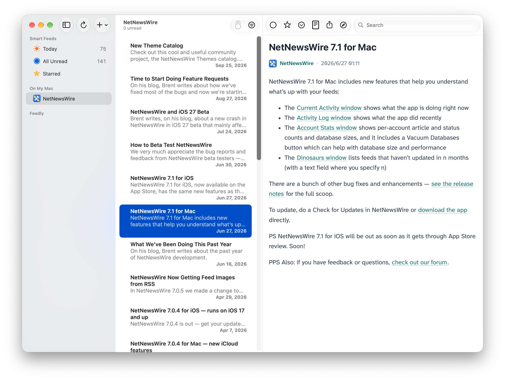

# Lucid Reader

Lucid Reader is a clean reading theme for [NetNewsWire](https://netnewswire.com/).

## Fonts

Body text prioritizes [Atkinson Hyperlegible Next](https://fonts.google.com/specimen/Atkinson+Hyperlegible+Next).
The theme does not bundle or download fonts. If the font is not installed, it falls back to macOS system fonts, `PingFang SC`, and other common sans-serif fonts.

## License

This project is released under the [MIT License](LICENSE).
